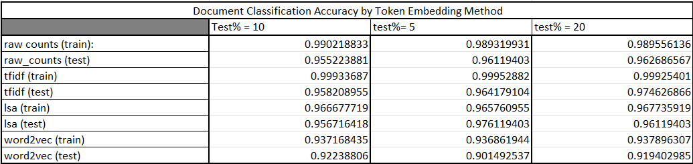

# Document Vectors and Author Prediction
This project focused on assessing different word embedding methods for document classification tasks. This experiment trains models using several types of word embeddings: Raw Count One-hot, term frequency-inverse document frequency (TFIDF), Latent Semantic Analysis(LSA), and Word to Vector (Word2Vec). 

Below is a matrix of the embedding performance across multiple percentages of train-test split (our tunable parameter for this experiment). We used the gensim pre-trained model for Word2Vec googl-news-300. 



What we see is a nearly inverse relationship between the complexity of the embedding technique and the predictive accuracy of the model. This is counter to our intuition in some ways but explainable in others. Firstly, we would expect embedding techniques which are more expressive than raw counts to be able to capture dinstinct information about a document, aiding in its ability to represent the unique differences between the two documents, and ultimately allowing the final model to better predict which document a sentence came from. Distinct information such as term frequency within a document which TF-IDF accounts for while also accounting for its frequency accross multiple documents (inverse document frequency), or the distributionalist contextual information captured by Word to Vector. We do note that TF-IDF appears to perform best accross all of our examples. But why would Latent Semantic Analysis and Word2Vec not perform as well?

Starting with the superior performance of TF-IDF over raw counts. This superior performance likely results from the fact that TF-IDF normalizes word frequencies by the number of documents the word appears in. The fact that this process resulted in better predictive accuracy indicates to us that Caroll's text and Austen's text had sentences or words that were entirely unique to each. By normalizing by the inverse document frequency, TF-IDF is able to weight unique words that are more discriminative over common words which appear in both documents. This is why it is able to outperform raw counts.

Regarding LSA, the method has the ability to capture semantic associations between words. By reducing the dimensionality of document representation it becomes easier to distinguish the 'closeness' of words while reducing noise. Its predictive accuracy is seen to be very close to TF-IDF, in some cases higher, and the difference between the two is not significant in our experiment. Of note, by giving LSA more training data its training predictive accuracy starts to outperform that of TF-IDF. Since we increased the size of the training data without increasing the number of documents, we were able to allow LSA the ability to capture more nuance within each document while preventing TF-IDF from gaining an advantage it otherwise would have from a larger corpus of documents and a better weight adjustment from its IDF normalization. 

Our Word2Vec results are interesting for a few reasons. It seems to be the more advanced of the methods employed in that it captures true context in tokens. For books that were writted almost 50 years apart and containing significantly different subject matter, one would assume that this would be a strong candidate for embedding method. That said, we used a model that was trained on present day Google News. This effectively mitigates the Word2Vec advantage because the context of words at the time these books were writted likely varies from the context of words today. If token meaning is defined by its context this pre-trained model can be problematic. Take, for instance, this quote from Sense and Sensibility:

```Run mad as often as you choose, but do not faint!```

It is plain english but in the modern day 'choose' is very infrequently used in that context. We might say, "Run as much as you want.." but Word2Vec trained on modern day Google News would likely have associated the word 'choose' in the context of a decision rather than a desire or inclination. It is for this reason we conclude that Word2Vec may very well be the best method for this document classificaiton but it would need to be trained on corpora written at the general time these books were authored.